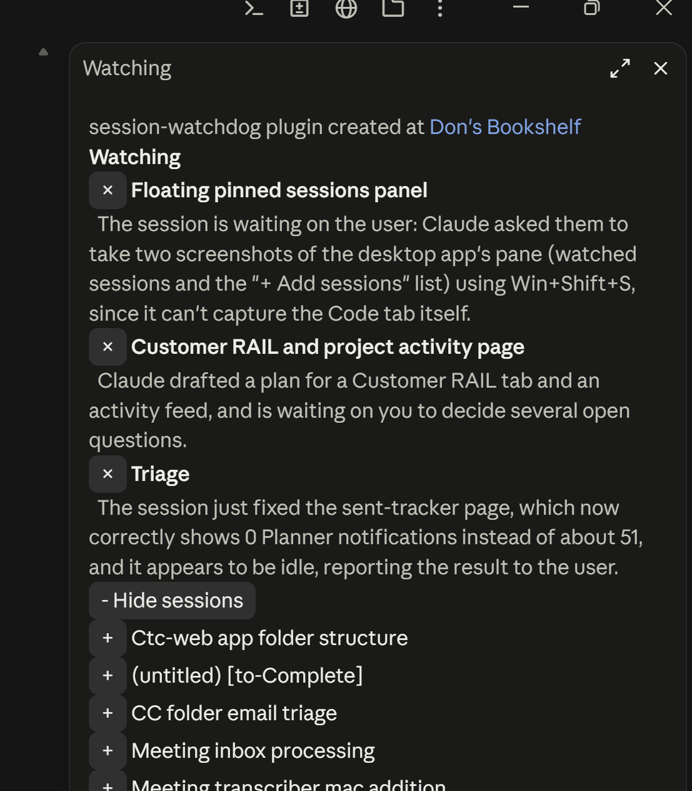
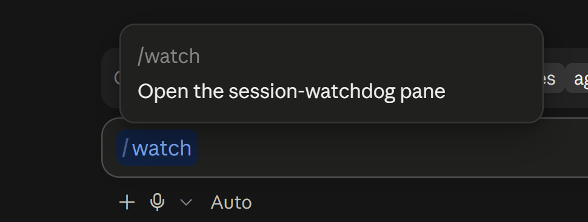

# claude-watchdog

`session-watchdog` is a Claude Code mod that keeps tabs on the sessions you care about: a pane with each watched session's title and a one-sentence summary of what it's doing or last did, and whether it's waiting on you.





- **`/watch`** opens the pane. Nothing opens on its own.
- **+ Add sessions** lists your 15 most recent sessions; click **+** to watch one, **×** to stop.
- Summaries come from Haiku, only when a session's transcript changed, checked every 45s while the pane is open. Closing the pane stops the checks.
- The watched list and summaries are shared, so every session's pane shows the same thing.

Reads local transcripts in `~/.claude/projects`, so cloud sessions aren't listed. On Windows it uses Git for Windows' `tail` to read large transcripts.

## Install

Requires a Claude Code build with function-hook plugins (2.1.286+).

```bash
git clone https://github.com/donroy26/claude-watchdog ~/.claude/skills/claude-watchdog
```

Start a new session (or run `/reload-plugins`), then `/watch`.

---

Created at [Don's Bookshelf](https://donsbookshelf.com/)
